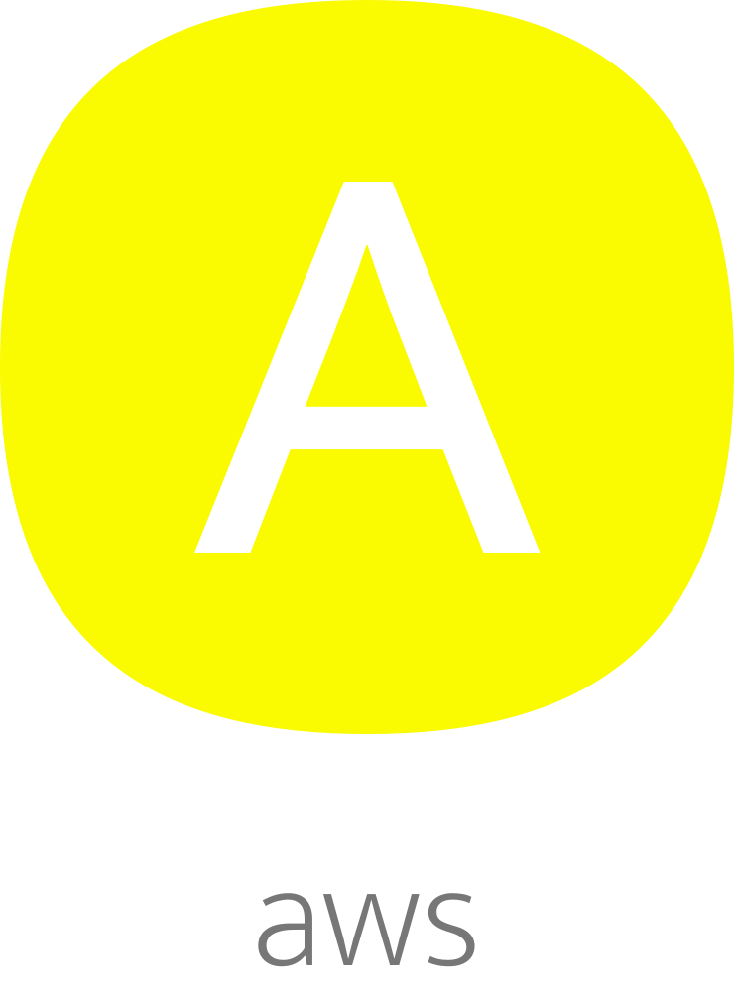

</br >
</br >

<p align='center'>
  <a target='_blank' rel='noopener noreferrer' href='#'>
    
  </a>
</p>

<h1 align='center'>amaui AWS</h1>

<p align='center'>
  AWS
</p>

<br />

<h3 align='center'>
  <sub>MIT license&nbsp;&nbsp;&nbsp;&nbsp;</sub>
  <sub>Production ready&nbsp;&nbsp;&nbsp;&nbsp;</sub>
  <sub>100% test cov&nbsp;&nbsp;&nbsp;&nbsp;</sub>
  <sub>Nodejs</sub>
</h3>

<p align='center'>
    <sub>Very simple code&nbsp;&nbsp;&nbsp;&nbsp;</sub>
    <sub>Modern code&nbsp;&nbsp;&nbsp;&nbsp;</sub>
    <sub>Junior friendly&nbsp;&nbsp;&nbsp;&nbsp;</sub>
    <sub>Typescript&nbsp;&nbsp;&nbsp;&nbsp;</sub>
    <sub>Made with :yellow_heart:</sub>
</p>

<br />

## Getting started

### Add

```sh
  // yarn
  yarn add @amaui/aws

  // npm
  npm install @amaui/aws
```

### Use

```javascript
  import AmauiAws from '@amaui/aws';
  // Make if you wanna a config file and
  // inside of it add all the process.env related props
  import Config from './config';

  // Make a new aws instance
  const amauiAws = new AmauiAws({
    access: {
      endpoint: Config.aws.s3.endpoint,
      credentials: {
        accessKeyId: Config.aws.s3.access_key_id,
        secretAccessKey: Config.aws.s3.secret_access_key,
      },
    },

    config: {
      region: Config.aws.s3.region,
    },

    bucket_name: Config.aws.s3.bucket_name,
  });

  // Add
  await awsS3.add('a', 4);

  // Get
  await awsS3.get('a');

  // 4

  // Remove
  await awsS3.remove('a');

  await awsS3.get('a');

  // undefined
```

### Dev

#### One time local setup

Install docker and docker-compose

  - https://docs.docker.com/get-docker
  - https://docs.docker.com/compose/install

Install python and pip

Install awscli
```sh
  pip install awscli
```

Make docker containers

```sh
  yarn docker
```

Make local S3 bucket

```sh
  yarn make-bucket

  yarn make-bucket-test
```

Install

```sh
  yarn
```

Test

```sh
  yarn test
```

### Prod

Build

```sh
  yarn build
```
